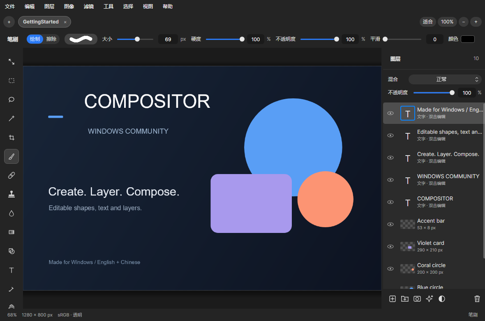
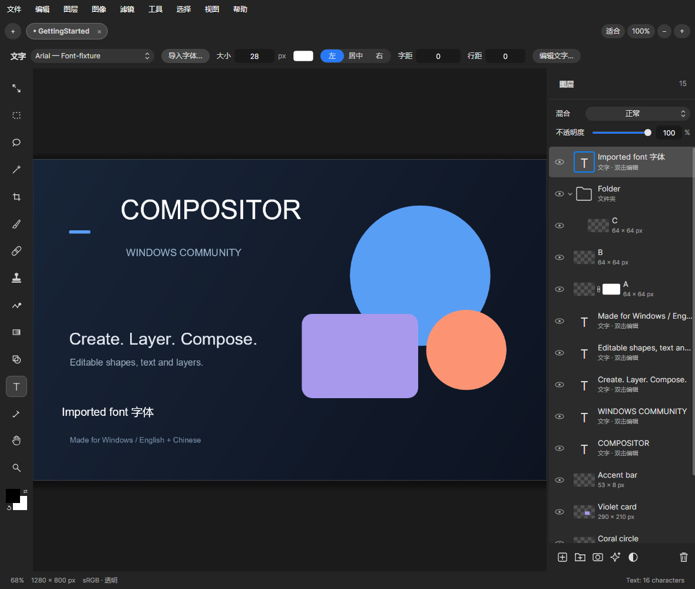
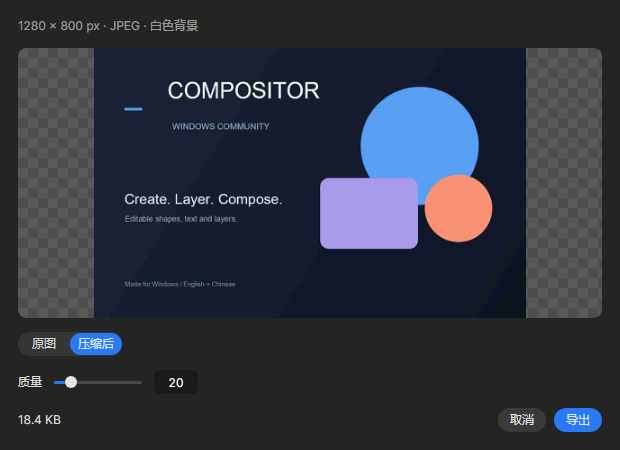
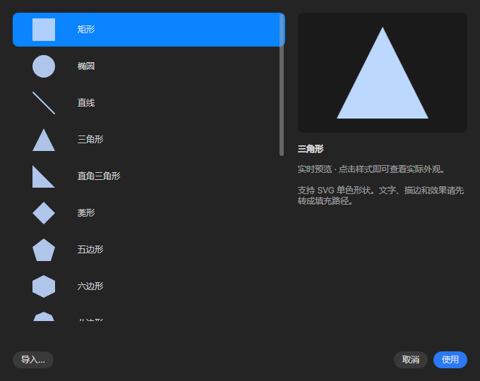
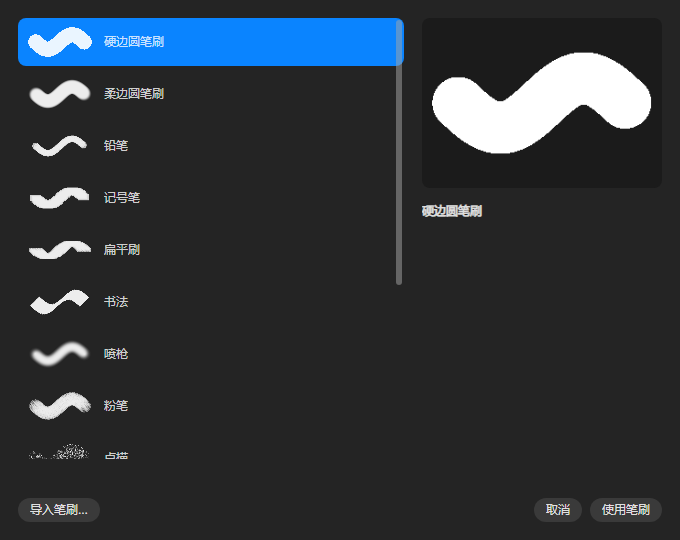

# Compositor Windows

## 原作与来源

本项目是 [robbietilton/Compositor](https://github.com/robbietilton/Compositor) 的独立 Windows 社区移植，基于 [chenguisen 的 C# Windows 移植](https://github.com/chenguisen/Compositor/tree/compositor_win) 继续开发。原作是一款面向图层合成、绘画与照片编辑的 macOS 图像编辑器。本项目保留原作及社区贡献者的版权和 [MIT 许可](LICENSE)。

Windows 版本提供中英文界面，保留 Windows 窗口按钮、文件操作和 Ctrl 快捷键，支持可编辑的 `.comp` 工程。

## 下载与安装

**[下载最新版安装包](https://github.com/IZILE/Compositor-Windows/releases/latest/download/Compositor-Setup.exe)** · [所有版本](https://github.com/IZILE/Compositor-Windows/releases) · [问题反馈](https://github.com/IZILE/Compositor-Windows/issues)

适用于 Windows 10/11 x64。安装向导可选择目录，默认位于 C 盘当前用户程序目录；升级沿用原位置，保留设置。安装后使用桌面或开始菜单快捷方式启动。

## 主要功能

- 图层、分组、混合模式、蒙版、选区、文字与变换；支持图层拖动排序、整组复制与蒙版复制。
- 顶部直接调整选区模式、扩展／收缩／羽化，以及文字字体、大小、颜色、对齐、字距和行距。
- 绘画、擦除、图章、修复、模糊、涂抹、液化、渐变和常用照片滤镜。
- 14 种笔刷、18 种可编辑形状、12 组渐变、10 种图案、36 个色板颜色。
- 支持 ABR/PNG 笔刷、SVG 形状、GGR 渐变、图片图案、GPL 色板及 TTF/OTF 字体导入。
- `.comp` 工程保存、PSD/PSB 导入、PNG/JPEG/PSD 导出；PNG 无损压缩、JPEG 质量调节与文件大小预览。

## 界面预览

以下画面来自 **0.6.7 当前应用界面的自动渲染**，随版本更新。

## 开发与兼容性

使用 .NET 10 和 Avalonia。见[构建说明](docs/BUILDING.md)、[工程格式](docs/project-format.md)及[功能对照与已知差异](docs/mac-parity-checklist.md)。

Mac 原版功能仍在持续移植。普通工程保持格式 11；扩展可编辑形状使用 Windows 格式 12，旧 Mac 版本需使用 PNG/PSD 导出。ABR 当前支持静态采样笔尖，SVG 支持填充轮廓，GGR 支持固定线性 RGB 分段。

依赖及素材格式参考的许可保存在 [windows/licenses](windows/licenses)。版本变更与验证记录见 [Releases](https://github.com/IZILE/Compositor-Windows/releases)。
