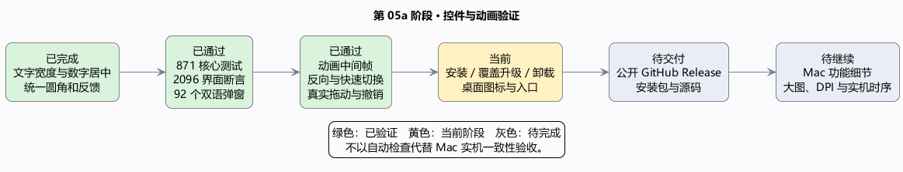

# 第 05a 阶段：控件、文字与动画可用性

这次把界面当成一套共用零件来修：不透明度标签按文字长度留空间，数字居中，并为负号和小数预留宽度。
菜单、工具按钮、标签、列表、滚动条、颜色数字步进器和蒙版目标采用一致的圆角与缓出反馈。
颜色窗口的确定、取消按钮恢复正常高度。Windows 的关闭、最小化、最大化、Ctrl 快捷键和文件操作方式保留。

动画像正在移动的抽屉：还没走完时反向操作，应从当前位置接着走，不能先跳回起点。
折叠面板现在只在目标高度改变时启动过渡；弹窗关闭会取消等待中的打开回调。
滑块和滚动条的位置即时跟随鼠标，颜色反馈单独渐变，避免拖动值被动画拖慢。

同时补上从选区建立蒙版、Alt 单独查看蒙版和返回画面的提示，修复灰度蒙版缩略图误变白的问题。
画笔能显示硬度内圈，图章能显示已经选定的来源位置。工程格式没有改变。

证据来自最终发布 EXE：871 项核心测试、2096 个界面断言、中英文共 92 个真实布局弹窗均通过。
还检查了中英文各 41 项 Windows 工作流、各 46 项鼠标操作、117 项快捷键和 26 项保存关闭流程。
中间帧检查覆盖按钮按下/释放、分段选择、工具选中、变换提示、折叠面板、弹窗打开和两个方向的滚动条；
反向切换、快速重复操作、最后状态、拖动方向和一次撤销均有检查。
颜色选择器的鼠标步进和方向键输入也通过了操作检查。
EXE 内含九个图标尺寸；可见轮廓中心误差不超过半个像素。桌面快捷方式的实际图标将在安装阶段再查。

这些自动检查不能证明所有 Mac 像素和原生时序都一致，也不能代表大图滤镜、多屏 DPI 和触控板的实机流畅度。
图层完整拖放、软笔实时草稿、图章来源像素预览、Camera Raw 取样细节和 Apple Vision 功能仍未完成。
下一步验证安装、覆盖升级、卸载和设置保留，再替换桌面入口并发布到公开 GitHub 仓库。

[可编辑 PlantUML](05a-interface.puml) · [本轮界面](05a-interface-zh-CN.png)
