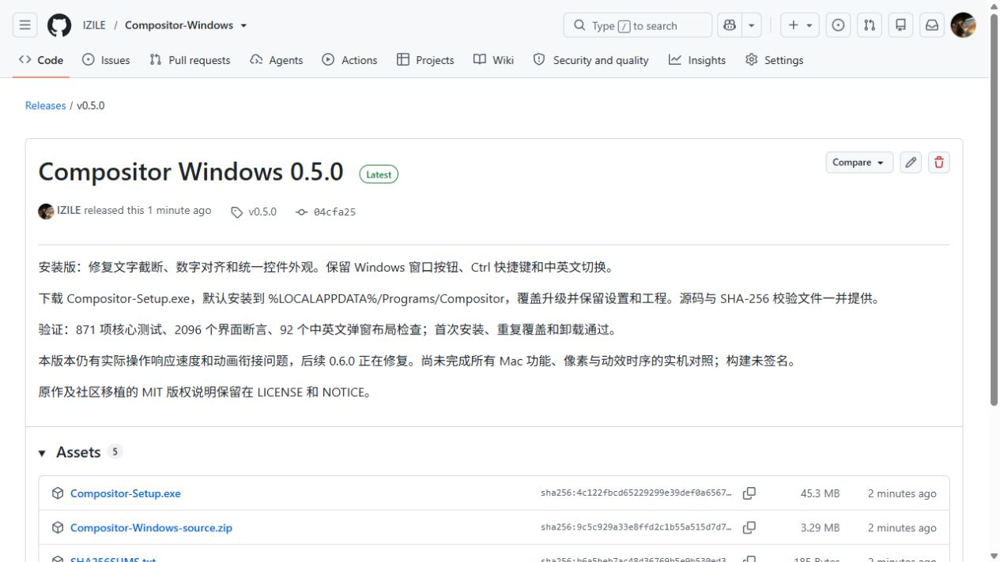

# 第 05b 阶段：安装版与公开发布

程序已经从桌面的单独 EXE 换成正式安装：文件放到 C 盘当前用户的程序目录，桌面只保留一个入口。
这像把工具放进固定抽屉，再贴上一个入口标签。以后升级覆盖同一位置，不会在桌面堆出多个版本。
旧桌面 EXE 在新安装验证通过后移除，已有设置保留。

安装检查覆盖首次安装、覆盖旧程序、重复安装和卸载。卸载后用户设置和额外的用户文件仍然存在。
实际安装版本为 0.5.0，桌面与开始菜单快捷方式指向安装位置，系统卸载列表只有一个对应项目。
通过 Windows 原生图标提取接口检查桌面快捷方式使用的九种尺寸；可见轮廓中心误差不超过半像素。
这证明图标文件与入口配置正确，仍需不同 DPI 下的桌面目视验收。

公开仓库 [IZILE/Compositor-Windows](https://github.com/IZILE/Compositor-Windows) 已建立，278 个经过筛选的工程文件已上传。
[v0.5.0 Release](https://github.com/IZILE/Compositor-Windows/releases/tag/v0.5.0) 包含安装包、源码压缩包和校验文件。
GitHub 返回的三个附件的大小与 SHA-256 均与本地对应文件一致。源码保留原作与社区移植的版权说明和依赖许可。
公开内容没有用户设置、个人工程、附件或带本机路径的诊断日志。

后续版本的发布脚本和 GitHub Actions 流程已纳入源码；云端流程还未完成实际运行验证。
用户随后反馈的“操作不跟手”和“选中动画缺少衔接”已进入 0.6.0 修复阶段，0.5.0 不因此被标为完全流畅。
下一步验证响应速度修复、后台滤镜预览和连贯工具选中动画，再覆盖本地安装并发布 0.6.0。
完整 Mac 功能与实机时序对照仍在后续工作中。

[可编辑 PlantUML](05b-install-release.puml)

