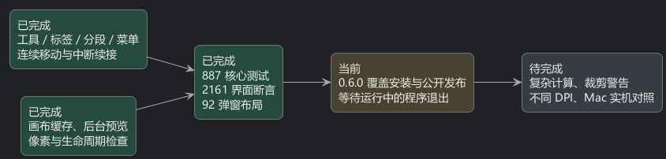

# 第 06a 阶段：连续选中与响应速度

这次把选中背景改成了一块会移动的圆角底板。像桌上的小标记滑向下一件工具，而不是旧标记消失、另一块突然出现。
左侧工具栏、项目标签、画笔／涂抹／修复／图章四组模式、Camera Raw 引导校正与曲线通道使用相同的 160 毫秒缓出过渡。
顶部菜单按钮、下拉菜单与右键菜单也使用各自保留的移动背景。鼠标与键盘改变的是同一个选中位置；禁用项和分隔线不会成为可执行选项。
普通按钮继续使用悬停、按下与松开的状态反馈。Windows 窗口按钮、快捷键和操作逻辑保留。

快速反向点击时，底板从已经走到的位置继续走。初次显示直接放到正确位置；布局重复计算不会重新开始动画。
切换中英文或缩窄窗口后，底板跟随新位置和文字宽度。还修复了 Camera Raw 重置后曲线通道与引导校正状态可能不一致的问题。
自动检查采样了动画中间位置，检查了反向、快速切换、真实菜单鼠标悬停、键盘跳过禁用项、子菜单以及关闭后的过期回调。
这些证明 Windows 实现存在连续过渡，不能证明与 Mac 实机逐帧完全一致。

性能方面，过去很多反馈会重新把所有图层合成一次。现在保留已经画好的结果，只有图像输入改变才重新计算，并限制缓存大小。
缓存记录蒙版启停、位置和图层变换，避免拿旧画面冒充新画面。离屏区域不再仅因画布总尺寸较小就全部重算。
滤镜预览移到后台串行计算，按钮仍可接收操作；只接收最新请求的结果，关闭面板后丢弃迟到的结果。

固定测试：2048×1536、六个栅格图层、1200×760 视口；真实 Skia CPU 绘制，每项取 16 次的中位数。

| 操作 | 修改前 | 当前最终程序 |
| --- | ---: | ---: |
| 选区等覆盖层重绘 | 193.65 ms | 2.28 ms |
| 平移 | 195.10 ms | 2.32 ms |
| 缩放 | 173.38 ms | 2.42 ms |
| 修改图层不透明度 | 152.85 ms | 44.48 ms |
| 修改图层变换 | 153.62 ms | 43.79 ms |

这是固定工程的计算耗时，不能当作实际屏幕帧率。复杂图层修改仍未达到每帧 16.7 毫秒，最终应用滤镜、大图导入和保存仍有同步工作。
核心测试 887 项通过；最终发布程序的 2161 个界面断言、中英文共 92 个弹窗布局、十组程序检查全部通过。
缓存检查还比较了修改前后的实际像素，后台预览检查验证了界面调度、最新结果和关闭后的生命周期。

体积优化以质量为前提。目前单文件程序约 141 MB，安装包约 47 MB；其中包含 .NET、Skia，以及 HEIC、RAW 等格式的解码依赖。
实验性的保守裁剪候选程序为 82,617,716 字节，Windows 工作流检查通过，但仍有 JSON 反射和 COM 的裁剪警告，因此没有作为正式交付。
没有为缩小数字移除图片格式、中英字体或工程保存能力。官方说明指出自包含程序包含运行库；裁剪动态访问代码需要额外处理。
参见 [.NET 单文件部署](https://learn.microsoft.com/en-us/dotnet/core/deploying/single-file/overview)和[裁剪选项](https://learn.microsoft.com/en-us/dotnet/core/deploying/trimming/trimming-options)。

本阶段的代码与程序检查已经完成。下一步覆盖正式安装并发布 0.6.0；当前正在等待运行中的程序保存并退出。
后续继续处理复杂计算、可验证的依赖精简、不同 DPI 及真实 Mac 功能与时序对照。

[可编辑 PlantUML](06a-responsiveness.puml)
