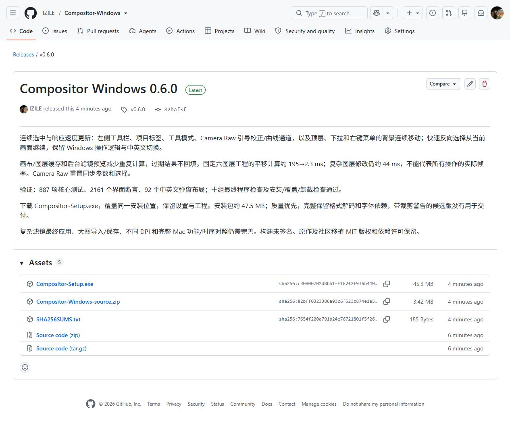
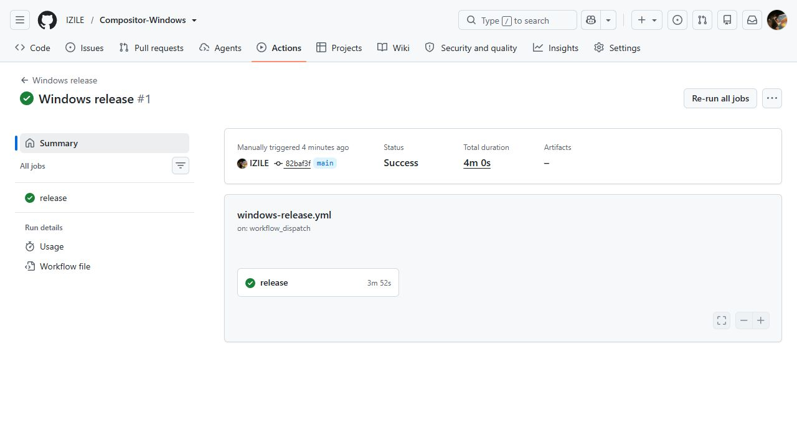

# 第 06b 阶段：0.6.0 安装与公开发布

0.6.0 已覆盖安装到 C 盘原有目录。桌面上的 Compositor 快捷方式现在打开新版，开始菜单也指向同一处。
可以把这次升级理解为换掉工具箱里的工具，保留原来的摆放位置和使用习惯。
升级前等用户保存并关闭了编辑器；升级后核对了程序版本、文件校验值、设置文件和卸载入口。
现有设置文件没有变化，旧桌面便携 EXE 已移除，系统中只有一个正式安装入口。

这次交付的主要变化是连续选中和减少重复计算。左侧工具、项目标签、分段选择，以及顶层、下拉和右键菜单的圆角背景会移动到新位置。
快速反向选择时会从当前画面接着移动。画布复用已完成的绘制，滤镜预览在后台串行计算，只显示最新结果。
Windows 窗口按钮、快捷键、操作方式，中英文切换与可编辑工程均保留。详细原理和性能数据见 [06a 报告](06a-responsiveness.md)。

质量优先于体积。正式单文件程序为 141,173,100 字节，安装包为 47,487,978 字节（约 47.5 MB，45.3 MiB）。
保留了原有格式解码、字体与运行依赖，没有为追求 12 MB 删除功能。
82,617,716 字节的实验裁剪候选通过了局部工作流检查，但仍有反射和 COM 警告，未用于正式交付。

验证证据：

- 本地 887 项核心测试、2161 个界面断言、中英文共 92 组弹窗布局及十组最终程序检查通过。
- 从公开源码暂存目录重新构建，零警告、零错误，887 项核心测试再次通过。
- 安装包完成独立的首次安装、覆盖旧版和卸载检查；用户文件保留。实际安装后的 Windows 工作流检查通过。
- 实际安装 EXE 与全部程序检查使用的 EXE 的 SHA-256 一致：`485ba47347092350e217f87f25e96869524ac9f16e6abd3e02b94996f246c2b0`。
- [公开 0.6.0 Release](https://github.com/IZILE/Compositor-Windows/releases/tag/v0.6.0) 的安装包、源码 ZIP 与校验文件均已上传，服务器记录的大小和摘要与本地一致。
- [GitHub Actions 第一次云端构建](https://github.com/IZILE/Compositor-Windows/actions/runs/37922475602) 成功：独立 Windows 环境完成构建、887 项核心测试、打包及十组程序检查。已有 Release 文件保持不变。

发布对应源码提交为 `82baf3f6a59e750839c3fe29aaacd4793d39c2be`。后续交付继续递增版本号发布到同一公开仓库，本机覆盖同一安装目录。
本地安装详情单独保存在交付目录的 `Compositor-Installation.json`，个人路径没有上传到公开仓库。

仍未完成的工作：固定六图层工程的图层修改计算约 44 毫秒；最终应用滤镜、大图导入和保存仍存在同步工作。
自动动画检查证明过渡连续，并不证明真实屏幕帧率或与 Mac 逐帧一致。不同 DPI、真实 Mac 动效时序、完整 Mac 功能仍需逐项对照。
下一步优先处理这些实际瓶颈及操作完整性，再尝试能够验证安全的依赖精简。

[可编辑 PlantUML](06b-install-release.puml)

