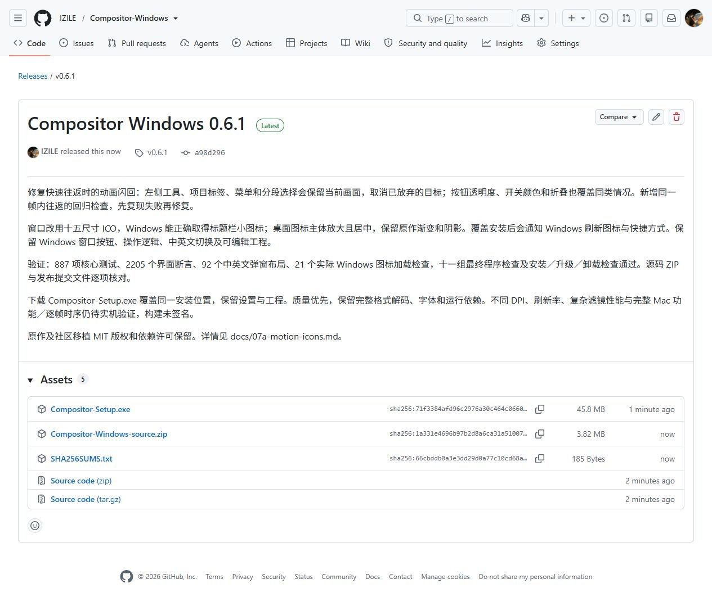
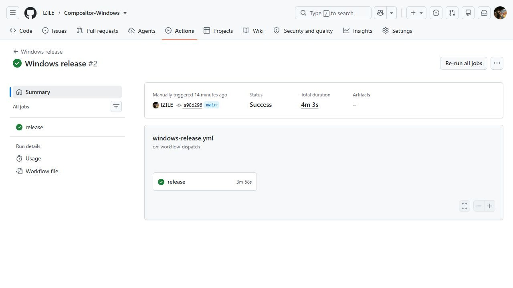

# 阶段 07b：0.6.1 已安装并公开发布

新版已经替换 C 盘原位置的程序。桌面和开始菜单的 Compositor 快捷方式打开 0.6.1，现有设置没有变化，系统只有一个正式卸载入口。可以把这次升级理解为修好工具箱里会跳动的指示牌、换上尺寸合适的标志，工具和工程仍按原来的方式使用。

这次修复了已复现的快速往返闪回，也改正了窗口图标加载方式并放大桌面图标主体。原理、失败复现和检查范围见 [07a 报告](07a-motion-icons.md)。保留 Windows 窗口按钮、操作逻辑、中英文切换及可编辑工程。

## 如何确认交付有效

- 887 项核心测试、2205 个界面断言、中英文共 92 组弹窗布局通过；最终单文件程序十一组检查均通过。
- 补充同一帧内快速往返的检查，修改前能够失败，修复后通过。覆盖工具、标签、分段、菜单、按钮反馈与折叠，检查中途及最终状态。
- 实际 Windows 窗口图标加载器的 21 个检查通过；EXE 和桌面快捷方式的十五种图标尺寸检查通过，主体中心误差不超过半像素。
- 隔离安装、旧版覆盖和卸载检查通过，测试用户文件保留。正式覆盖安装后核对版本、程序摘要、快捷方式、设置和卸载入口，安装日志记录了图标更新通知。
- [公开 Release](https://github.com/IZILE/Compositor-Windows/releases/tag/v0.6.1) 已提供安装包、源码 ZIP 和 SHA-256 文件；服务器记录的三项大小与摘要均与本地一致。源码包的 314 个文件与发布提交的 Git 文件对象逐一相符。
- [独立 Windows 云端构建](https://github.com/IZILE/Compositor-Windows/actions/runs/37929906799) 成功，重新从公开源码完成 887 项核心测试、构建、打包及十一组程序检查。云端保留了已上传的 Release 文件。

发布源码提交：`a98d296d9391c4da50cd56ffdcee96362c6de007`。
已安装程序 SHA-256：`9fd7dbba4e020ed3ca5461d617d5044eca58249f55a036c94a24971f5f2a1043`。
安装包 SHA-256：`71f3384afd96c2976a30c464c0660cc11843734c25ee7ea200f199403838eaf1`。

安装包为 48,075,660 字节（约 48.1 MB／45.8 MiB）；完整单文件程序为 141,930,860 字节。保留运行库、解码器和字体，没有以删除功能换取体积。后续更新继续覆盖同一安装目录，并发布到同一公开仓库。

## 尚未完成与下一步

用户实机仍报告左侧悬停与选中底色叠加造成闪烁。0.6.1 的坐标连续性检查没有覆盖最终背景叠色；该问题继续在 0.6.2 中通过背景像素和控件身份检查处理。

不同物理 DPI、刷新率和真实 Mac 逐帧对照仍待验证，不能把自动检查解释为所有设备都无闪烁或已经一比一完成。固定六图层测试的平移计算约 2.6 毫秒，图层修改约 50 毫秒，复杂计算仍是后续优化重点；这些是自动 CPU 测量，并非屏幕帧率。

完整图层拖放、蒙版变换、软笔实时草稿、部分 Camera Raw 细节及 Apple Vision 功能仍未完成。下一步优先处理实机显示、实际交互延迟和这些功能差异，详见[对齐记录](mac-parity-checklist.md)。

[可编辑 PlantUML](07b-install-release.puml)

