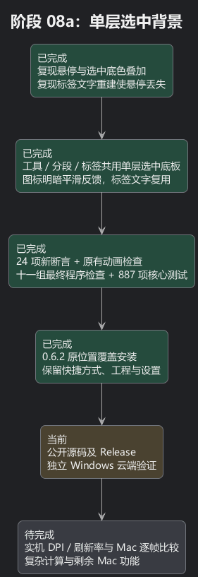
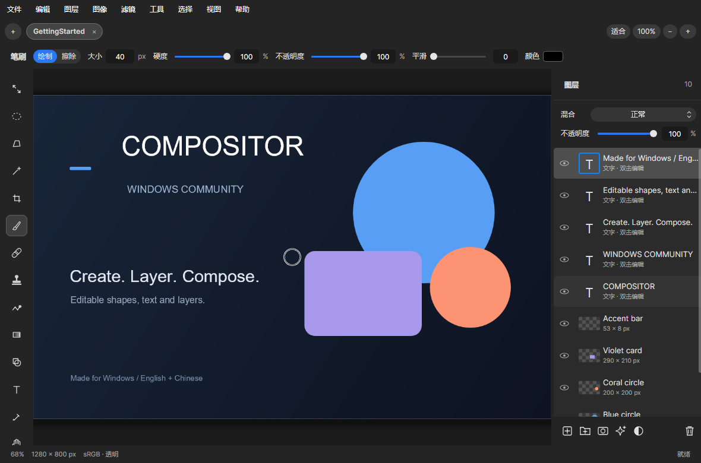

# 阶段 08a：让选中背景只画一层

用户看到的闪烁确实有另一处来源：移动的选中框上，还盖着通用按钮的悬停和按下背景。就像同一块玻璃上叠了两层浅色贴纸，鼠标经过、按下和松开时，颜色会忽明忽暗。之前的检查确认了框的位置连续，却没有检查最后画出来的颜色，因此没有抓住这个问题。

现在左侧工具、分段模式和标签选择只保留一块连续移动的选中底板。鼠标悬停与按下时，图标或文字用 80 毫秒平滑改变明暗；底板继续用 160 毫秒移动。普通动作按钮、标签关闭按钮仍有自己的反馈。选择、快捷键、拖动排序和 Windows 窗口操作逻辑保留。

还找到了标签页的一处断点：原来切换时会重新创建文字控件，鼠标悬停状态随旧控件短暂丢失。现在复用原来的文字控件，只改内容和字重，松开时的反馈得以衔接，也减少了不必要的对象创建。

## 如何确认这次有依据

- 对照 Mac `ContentView.swift` 的工具栏源码，原版采用 plain 按钮和选中圆角背景，没有在这里另外设置悬停底板。这是源码比较，不能证明与实机每帧相同。
- 新增检查在修改前复现失败：已选中工具被鼠标悬停后，背景像素改变，说明发生叠色。
- 同一检查在修复后通过。24 项新增断言覆盖三类选择器的已选／未选背景像素、按下中间帧、选择逻辑、底板交接及松开后的悬停状态。标签控件重建也曾使松开检查失败，改为复用后通过。
- 最终自包含程序通过十一组检查，包括 2229 个界面断言、中英文共 92 组弹窗布局、编辑操作和 Windows 工作流。原有快速往返动画检查也通过。887 项核心测试通过，构建零警告。
- 隔离安装、0.6.1 程序覆盖和卸载检查通过，测试用户文件保留。正式 0.6.2 已覆盖 C 盘原安装位置，桌面及开始菜单快捷方式、现有设置和单一卸载入口经核对保留。

这份报告记录的是本地验证阶段；公开源码、Release 和独立云端构建是下一步。

## 仍未完成

这些检查读取程序渲染的像素和状态，不能替代不同物理 DPI、刷新率及真实 Mac 的逐帧对照，也不能保证所有设备完全无闪烁。80／160 毫秒是本地调校时间。固定六图层测试的平移计算约 2.3 毫秒，图层修改约 40–44 毫秒，复杂计算仍有瓶颈；这些是 CPU 测量，不是屏幕帧率。

完整图层拖放、蒙版变换、软笔实时草稿及部分 Camera Raw 功能仍在[对齐记录](mac-parity-checklist.md)中。下一步完成公开发布与独立检查，再继续实机反馈和剩余功能。

[可编辑 PlantUML](08a-selection-surfaces.puml)

