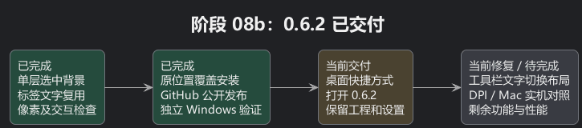
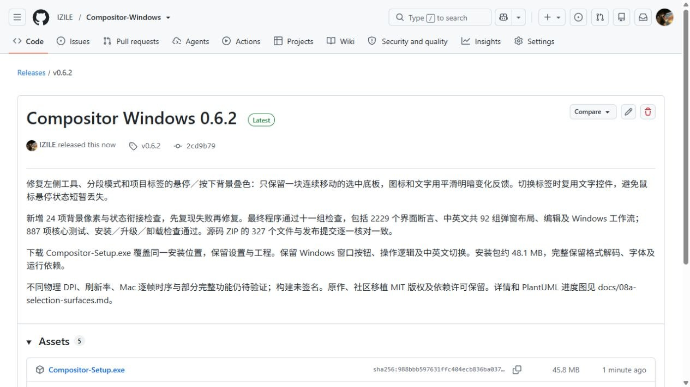
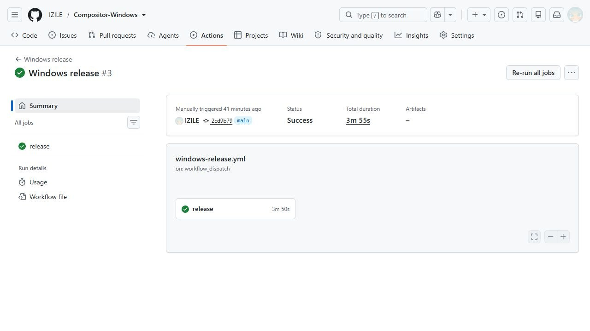

# 阶段 08b：0.6.2 已安装并公开发布

这次把选中框上多盖的一层背景去掉了，鼠标经过、按下和松开时改为平滑调整图标或文字的明暗。标签文字也改为复用，避免切换时悬停状态突然丢失。可以理解为指示框始终只有一块，鼠标反馈不再另外盖住它。

新版 0.6.2 已替换 C 盘原位置的程序。原来的桌面和开始菜单快捷方式打开这一版，现有设置未变，系统仍只有一个正式卸载入口。保留 Windows 窗口按钮、操作习惯、中英切换与可编辑工程。具体原因、失败复现和检查范围见[单层选中背景报告](08a-selection-surfaces.md)。

## 怎样确认交付

- 24 项新的背景像素和状态衔接断言通过，修改前能复现叠色及标签悬停中断。原有快速往返动画检查继续通过。
- 本地最终程序十一组检查、2229 个界面断言、中英文共 92 组弹窗布局、887 项核心测试通过。隔离首次安装、覆盖、卸载及用户文件保留检查通过。
- [公开 Release](https://github.com/IZILE/Compositor-Windows/releases/tag/v0.6.2) 已提供安装包、源码 ZIP 和 SHA-256 文件。服务器三项附件大小和摘要均与本地一致；源码包的 327 个文件与发布提交的 Git 文件对象逐一相符。
- [独立 Windows 云端构建](https://github.com/IZILE/Compositor-Windows/actions/runs/37933897929) 成功。另一台 Windows 从公开源码重新完成 887 项核心测试、打包及十一组最终程序检查，并保留了已经发布的附件。

发布源码提交：`2cd9b79401e118ea934feb20ae6269a98b6261a1`。
已安装程序 SHA-256：`dfc3e0d3f81d279f8b9a549d57958559767ba44553daea030855f54322b76939`。
安装包 SHA-256：`988bbb597631ffc404ecb836ba0373c6fd78918afd061852d8628a41a509c465`。

安装包 48,075,415 字节，约 48.1 MB／45.8 MiB。完整保留格式解码、字体与运行依赖，没有以删除功能换取体积。后续版本仍在同一个本地目录覆盖升级，并发布到同一公开仓库。

## 仍未完成与下一步

用户随后发现笔刷与橡皮擦名称长度不同，会推移共享工具栏；这一布局问题尚未在 0.6.2 修复，正在下一版 0.6.3 中处理，并检查其他模式和数值变化的同类问题。

程序像素和状态检查能确认这次发现的两处问题已修复，不能替代不同物理 DPI、刷新率及 Mac 实机的逐帧对照。下一步继续根据实机反馈核对动画衔接，并完善复杂计算、完整图层拖放、蒙版变换、软笔实时草稿和部分 Camera Raw 功能。当前没有证据表明所有 Mac 功能、像素与动效时序已完全一致。

[可编辑 PlantUML](08b-install-release.puml)

