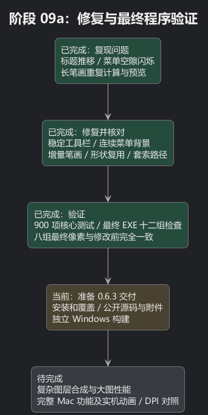

# 阶段 09a：连续绘制、菜单与工具栏修复

以前长笔画像“先把整段路记下来，松手后再从头走一遍”：每帧也会重新提交所有旧线段。现在只处理刚走过的新路段，临时预览复用同一张图；松手只合并结果，整条笔画仍然是一次撤销。画在蒙版、空白图层或旋转图层上也保留原有约束。中途换工程、选区、像素或参数时，过期草稿不能写回。

菜单的另一处闪烁已复现：指针经过项目间的空隙、分隔线或禁用项时，背景会先消失又出现。现在指针仍在菜单内时保留同一块背景，再连续移到下一个可用项目。键盘选择、子菜单与关闭流程仍正常。原失败记录保留在本地验证目录。

笔刷／橡皮擦、矩形／椭圆、自由／多边形套索，以及同组下拉选项和参数标签按当前字体、中英文最长内容预留空间。因此切换文字不会推移共享控件，也无需把文字截短。形状预览复用已经转换的图像；长套索通过一条连续路径绘制。

## 证据与测量范围

- 900 项核心测试通过，包括 13 项新增的增量笔画、撤销、蒙版、旋转、空白及过期目标拒绝检查。
- 最终独立 EXE 的十二组检查通过，包含 3015 个界面断言、中英文布局、真实路由鼠标输入、Windows 操作、图标和两组性能测量。
- 八组硬／软笔刷、橡皮擦的最终像素 SHA-256 与修改前逐字节一致；增量结果与整笔计算一致。没有减少采样点、提高笔刷间距或降低最终图像分辨率。
- 预览在模拟 100%、150%、200% 缩放的渲染检查中通过；8 位透明缓冲合成的局部颜色差最多 3/255，整幅平均差小于 0.25/255。它是临时反馈，最终工程像素的八组对照是完全一致的。检查中发现并修正了高 DPI 源图矩形截取问题。
- 菜单以 1 像素间隔真实移动指针，覆盖快速双向移动、空隙、禁用项和分隔线；背景保持不透明。原有同帧往返、反向动画、键盘与子菜单检查继续通过。

下面为同一台电脑的确定性 CPU 测量：2048×1536 单图层、1024 个点的长轨迹，完整笔刷计算取三次中位数；每次新输入取 1024 次中位数与 P95，松手合并为单次测量。比较的目的在于说明工作分散到输入阶段，而非声称计算凭空消失。

| 笔刷情形 | 旧版松手整笔计算 ms | 新版每次输入中位 ms | 新版每次输入 P95 ms | 新版松手合并 ms |
| --- | ---: | ---: | ---: | ---: |
| paint-40-hard | 2310.6 | 0.30 | 0.43 | 17.9 |
| erase-40-hard | 2313.4 | 0.30 | 0.43 | 14.6 |
| paint-40-soft | 1674.2 | 0.87 | 1.19 | 16.6 |
| erase-40-soft | 1667.9 | 0.88 | 1.19 | 13.5 |
| paint-200-hard | 10165.3 | 0.67 | 1.52 | 25.2 |
| erase-200-hard | 10147.7 | 0.65 | 1.52 | 15.4 |
| paint-200-soft | 7498.3 | 4.58 | 6.12 | 26.1 |
| erase-200-soft | 7487.1 | 4.58 | 6.12 | 15.2 |

4096 点临时笔画重绘由 23.14 ms 降到 1.60 ms。
固定六图层工程中：平移 2.31 ms、缩放 2.44 ms、框选 2.42 ms、渐变引导线 2.44 ms、4096 点套索 4.10 ms。
套索修改前约 9.14 ms。形状重复预览 3.42 ms，改变尺寸 6.50 ms。

## 尚未完成与下一步

图层不透明度变化仍为 39.72 ms，图层变换仍为 43.13 ms；这两项需要重新合成，仍是明显的后续性能工作。渐变最终填充、滤镜最终应用、大图导入／保存及特别大的软笔也仍可能耗时。这些 headless／真实 Skia CPU 测量不代表物理鼠标到显示器的延迟或实际 FPS。

本阶段已完成源码与最终程序验证；接下来检查安装、覆盖原位置并公开发布 0.6.3，再让独立 Windows 云端重新构建。安装向导保持可选目录，默认 C 盘当前用户程序目录，升级记住此前选择的位置。

Mac 参考为已检出的 1.4.7 源码，保留 Windows 窗口按钮与操作逻辑、中英切换及可编辑工程。Mac 实机逐帧、物理多 DPI、全部功能及像素对照仍未完成。

[可编辑 PlantUML](09a-input-layout.puml)

