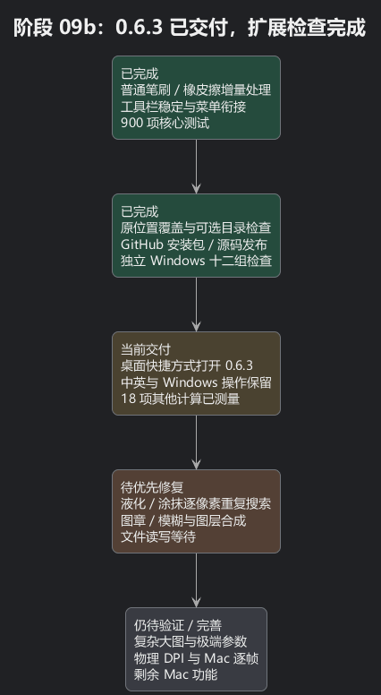
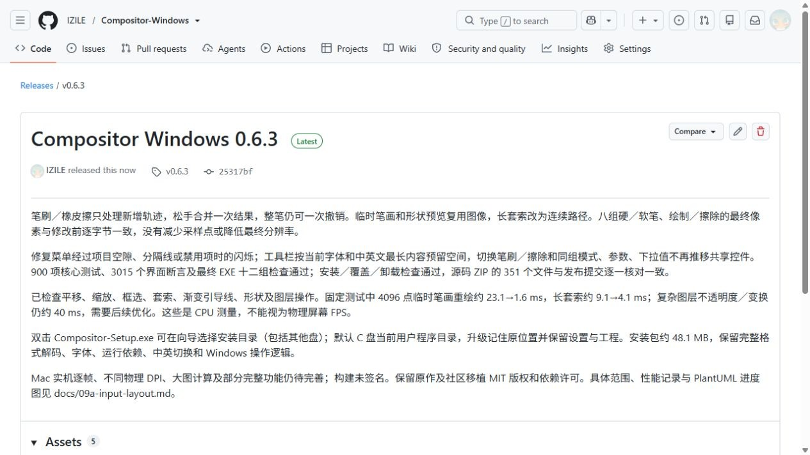
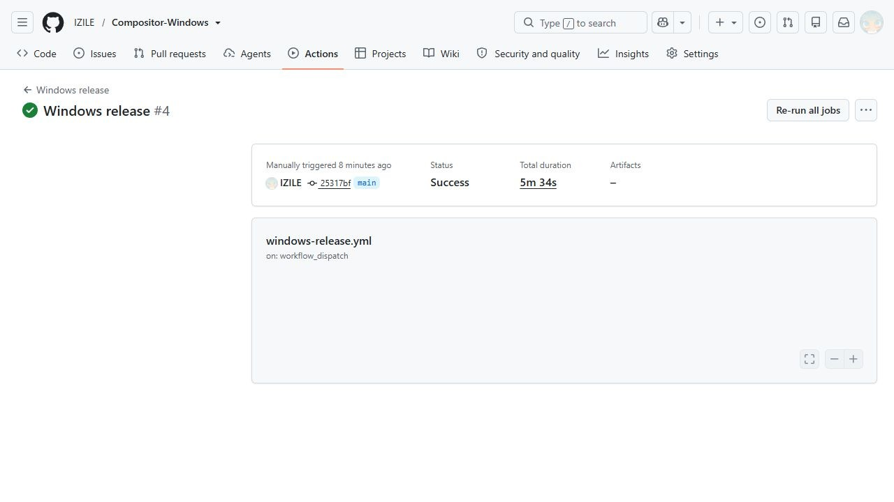

# 阶段 09b：0.6.3 交付与其他功能性能检查

普通笔刷和橡皮擦现在边输入边处理新增轨迹，不再等松手后从头计算整条笔画。菜单移动背景经过空隙时保持连续，工具栏按实际字体的最长中英文内容预留空间，避免切换文字推开其他控件。可以理解为：已经做过的工作留住，后来的输入只补上新部分。具体原因、修改前失败和像素对照见[阶段 09a](09a-input-layout.md)。

0.6.3 已覆盖 C 盘原来的安装目录，桌面和开始菜单快捷方式打开新版。现有设置未变，系统仍只有一个正式卸载入口。双击安装包会显示向导，可点击“浏览”选择目录和其他盘；默认当前用户 C 盘程序目录，升级记住之前选择的位置。之前自动安装使用静默模式，所以没有显示目录页。

## 确认交付的证据

- 900 项核心测试、3015 个界面断言、中英文共 92 组弹窗布局，以及最终 EXE 十二组检查通过。普通笔刷／橡皮擦八组最终像素与修改前完全一致，整条笔画仍是一次撤销；没有减少采样点或最终分辨率。
- 隔离自定义目录安装、重复覆盖、安装后 Windows 工作流和卸载后保留用户文件通过。正式安装程序摘要与已验证 EXE 一致，设置保留。
- [公开 Release](https://github.com/IZILE/Compositor-Windows/releases/tag/v0.6.3) 提供安装包、源码和 SHA-256 校验。服务器三项附件大小和摘要与本地一致；源码 ZIP 的 351 个文件与公开 Git 文件对象逐一相符。
- [独立 Windows 云端构建](https://github.com/IZILE/Compositor-Windows/actions/runs/37940735257) 从公开源码重新完成 900 项核心测试、构建打包与十二组最终程序检查。已发布附件保持原有摘要和对象，没有被云端覆盖。

公开源码提交：`25317bf32a452dee7fc46d0b3930c3a3490ce84a`。
已安装 EXE SHA-256：`5590f8cd15f877a5eff42b56251fdc18ca5321cbcab7b52c16fa06a2bd26ff21`。
安装包 SHA-256：`4312bb09173ba5d2d57cb55cb8d66c65fef0c44585ec3ad87e35d89f09f1b3b9`。

安装包 48,091,535 字节，约 48.1 MB。完整保留格式解码、字体和运行依赖，没有用删功能换体积。

## 其他功能确实还有卡顿

最终 EXE 的固定六图层测试中，平移、缩放、框选和渐变引导线约 2～3 ms；4096 点套索从约 9.1 降到 4.1 ms，形状重复预览约 3.4 ms。图层不透明度重新合成约 39.7 ms，变换约 43.1 ms，仍需要后续优化。

发布后又扩展检查下面 18 项计算。这一部分是从相同 0.6.3 核心源码建立的独立诊断程序，直接调用计算方法；每项先预热一次，再测三次，取中位数。图像是确定性生成的测试图，文件只写入诊断目录。它检查计算耗时，不测量真实鼠标到屏幕的延迟，也不能等同于实际 FPS。

| 操作 | 图像尺寸 | 中位 ms | 三次最慢 ms |
| --- | --- | ---: | ---: |
| 图章 | 1024×768 | 159.86 | 205.79 |
| 模糊笔刷 | 1024×768 | 285.11 | 286.05 |
| 液化（推移像素） | 1024×768 | 18074.17 | 18154.55 |
| 涂抹（拖动颜色） | 1024×768 | 6420.31 | 6426.06 |
| 污点修复（短轨迹） | 1024×768 | 14.65 | 15.52 |
| 线性渐变最终填充 | 2048×1536 | 242.55 | 242.63 |
| 魔棒连续选区 | 2048×1536 | 27.04 | 28.34 |
| 高斯模糊最终应用 | 1024×768 | 171.56 | 180.17 |
| 动态模糊最终应用 | 1024×768 | 306.19 | 312.27 |
| 色调对比度最终应用 | 1024×768 | 42.33 | 42.83 |
| 镜头校正最终应用 | 1024×768 | 22.26 | 23.47 |
| 工程保存 | 2048×1536 | 62.44 | 75.89 |
| 工程打开 | 2048×1536 | 4.12 | 4.21 |
| PNG 图像编码 | 2048×1536 | 57.16 | 73.01 |
| Camera Raw 最终应用 | 1024×768 | 106.75 | 106.78 |
| 图像缩放 | 2048×1536 | 16.75 | 17.17 |
| PNG 图像解码 | 2048×1536 | 4.26 | 4.31 |
| PNG 导出（合成、编码、写盘） | 2048×1536 | 164.34 | 307.73 |

液化和涂抹使用 128 点轨迹、40 像素直径、50% 硬度和强度。普通图章和模糊笔刷用相同轨迹；污点修复只用 3 点短轨迹、30 像素笔尖，不能据此声称大面积修复同样快。渐变是最终填充，滤镜是最终计算；PNG 导出包含画布合成、编码和写盘，PNG 解码只测单张 PNG，不包含 RAW、PSD 或大批量导入。

液化约 18 秒、涂抹约 6.4 秒是最明显的新问题。源码中一处主要原因是：回写每个像素时，再遍历全部笔刷印记判断是否经过，图像和轨迹越长，重复工作越多。这两个工具、图章与模糊笔刷仍在松手后完成计算，尚未使用这次普通笔刷的增量提交。它们并未在 0.6.3 修好。

保存和 PNG 导出虽然测得约几十至一百多毫秒，但仍在界面线程上计算和写盘；大图或慢磁盘可能使暂停更明显。已有滤镜预览使用后台任务和过期结果拒绝，最终计算仍有等待成本。不能把预览不卡等同于所有最终操作都即时完成。

## 尚未完成与下一步

后续优先消除液化／涂抹每个像素遍历整段轨迹的重复搜索，并用完全相同的像素结果、撤销和变换图层检查约束优化；再处理图章、模糊笔刷、图层合成和文件读写的等待。大图、复杂图层、RAW／PSD、滤镜极端参数及长时间使用还需要单独压力测试。

保留中英切换、可编辑工程、Windows 窗口按钮及操作逻辑。Mac 1.4.7 源码是参考，Mac 实机逐帧、全部功能、物理多 DPI 和完整渲染对照仍未完成。

[可编辑 PlantUML](09b-install-release.puml) · [扩展性能数据](09b-performance-audit.json)

