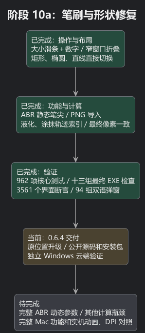
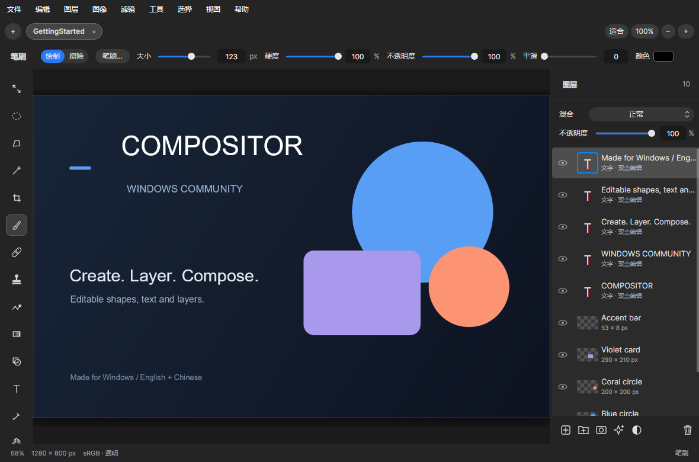
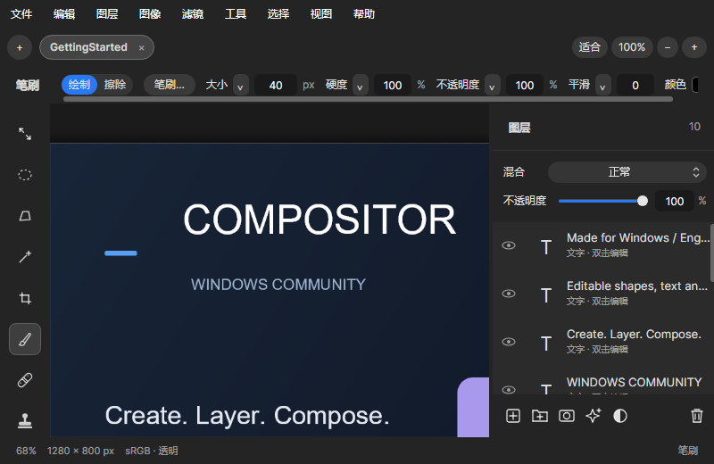
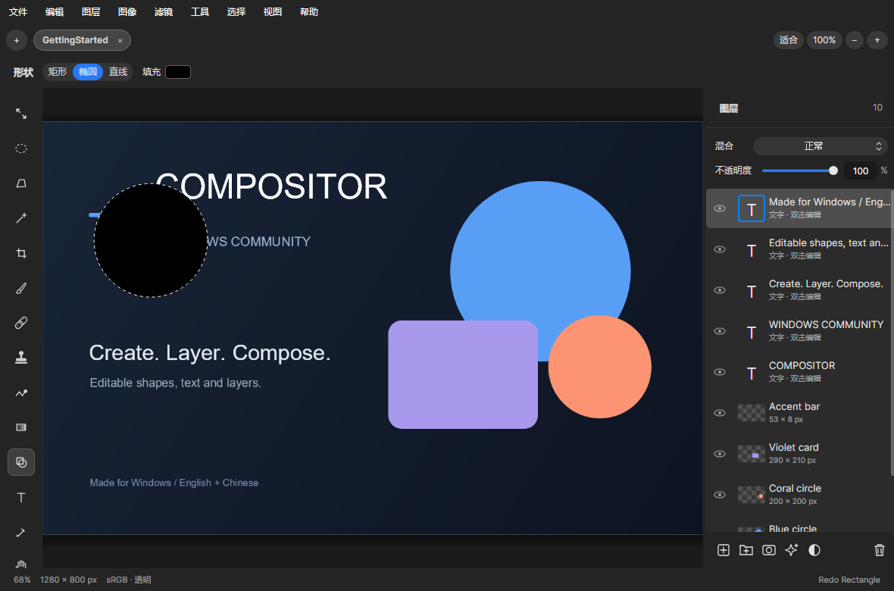
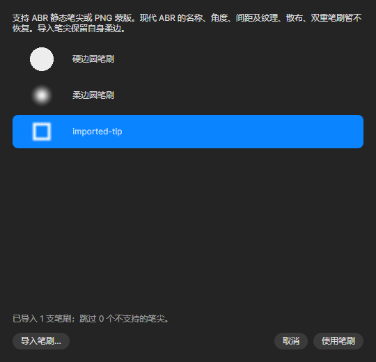

# 阶段 10a：笔刷调节、导入、形状和计算提速

## 用平实的话说明

原来调大小主要靠输入数字。现在像调音量一样拖动滑条，同时保留数字输入。笔刷、橡皮擦、图章、修复、模糊、液化和涂抹共用这套调节方式。小笔刷需要精细，大笔刷需要跨得快，因此大小轨道用对数刻度；手动输入仍保留精确数值。

工具栏空间不足时，先把轨道收成一个可点开的按钮，数字一直留在原处；宽窗口展开。拖动过程中不会突然拆掉正在操作的控件。如果窗口更窄，最后仍可横向滚动。实际路由输入检查覆盖 800、1180 和 1680 宽度，中英文均通过；默认 1180 宽度的六类笔刷工具整行可见。

形状现在直接显示“矩形／椭圆／直线”。检查发现两处真实错误：选择没有传到画布；相同大小的椭圆会拿到先前缓存的矩形。现在形状、颜色、尺寸和直线端点都纳入预览的判断，负斜率直线与停住鼠标后换颜色也正确更新。绘制仍保留可编辑形状和一次撤销。

新增“笔刷…”面板，能导入 ABR 静态采样笔尖和 PNG 蒙版、显示缩略图并记住已导入笔刷。透明 PNG 使用透明度；不透明图片把深色当作笔墨。导入笔尖可用于绘制、擦除和图层蒙版；其他笔刷工具继续使用各自原有圆形笔头。这个导入面板是新增功能，所比较的 Mac 1.4.7 相关控件源码中没有现成的笔刷文件导入实现。

液化和涂抹以前会让每个像素反复询问整条轨迹。现在先找附近轨迹，再做原来的精确计算，相当于查附近街区而非每次查全城。没有删采样点或降低图像分辨率，四类工具的最终像素均与修改前完全一致。

## 证据和测量范围

- 962 项核心测试通过，其中新增 9 项轨迹索引检查、52 项笔刷导入／绘制／保存／撤销检查及 1 项编辑元数据检查。
- 最终独立 EXE 的十三组检查通过：3561 个界面断言、94 组中英文弹窗、Windows 工作流、快捷键、图标、连续选择动画及三组性能检查。
- 实际路由鼠标／键盘事件验证：滑条连续数值、输入提交、窄窗口弹出轨道、拖动中调整窗口、形状切换及提交、导入面板和连续移动选择背景。
- ABR 1、2、6、7、9、10 的静态采样蒙版覆盖原始和 RLE 压缩、8／16 位数据（当前绘画引擎使用 8 位蒙版）。还检查截断、过大尺寸、非法数据及资料库保存失败时保护已有内容。
- 一份真实 ABR 的 112×105 蒙版逐字节等于独立解码的 PNG 参考；公开交付只包含证明记录和自制样例，不包含该外部笔刷文件。[独立参考来源](https://github.com/Agamnentzar/ag-psd/tree/master/test/abr-read/sample-and-pattern)
- 安装测试验证首次安装、从前版覆盖、运行及卸载。原位置和设置保留；卸载不删除用户测试文件。正式覆盖与 GitHub 发布在下一阶段完成。

下表为同一电脑、同一生成图像和轨迹：1024×768 单图层、128 点、直径 40、硬度／不透明度 0.5，预热一次后取三次 CPU 计算中位数。它不是物理鼠标延迟或屏幕 FPS。Clone 和 Blur 未改变核心算法，两次测量的差异不算优化成果。

| 工具 | 修改前 ms | 修改后 ms | 最终像素 |
| --- | ---: | ---: | --- |
| Clone | 149.97 | 140.52 | 一致 |
| Blur | 276.67 | 281.39 | 一致 |
| Liquify | 17819.41 | 134.18 | 一致 |
| Smudge | 6387.05 | 49.05 | 一致 |

## 尚未完成和下一步

ABR 仅恢复静态采样蒙版。程序生成的笔刷，以及现代 ABR 的名称、角度、间距、纹理、压感、散布和双重笔刷等描述参数尚未恢复。导入面板明确提示此限制；导入笔尖采用自己的软边，硬度调节在此情况下禁用。

液化／涂抹仍在松手时写入，尚无逐段实时变形；超大笔刷仍可能慢。图章／模糊、复杂图层合成、最终滤镜和大图读写仍是后续性能工作。Mac 涂抹采样与颜色携带算法仍存在差别，不能把本次提速说成完整功能对齐。

保留 Windows 窗口按钮和操作逻辑、中英切换及可编辑工程。当前证据来自 Mac 源码对照和 Windows 自动路由／Skia 渲染，不是 Mac 实机逐帧或像素级一致验收。下一步是原位置升级、公开源码和安装包，以及独立 Windows 云端重建检查。

[可编辑 PlantUML](10a-brush-tools.puml)

