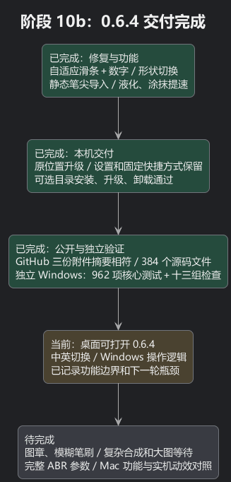
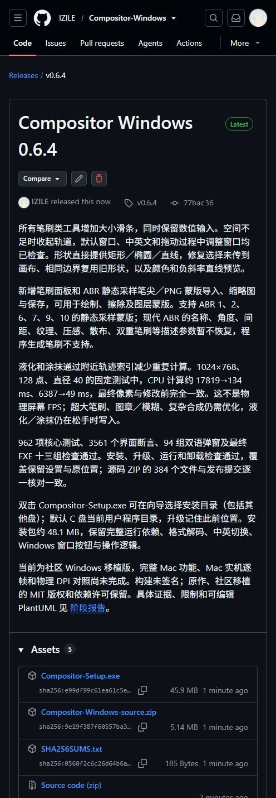
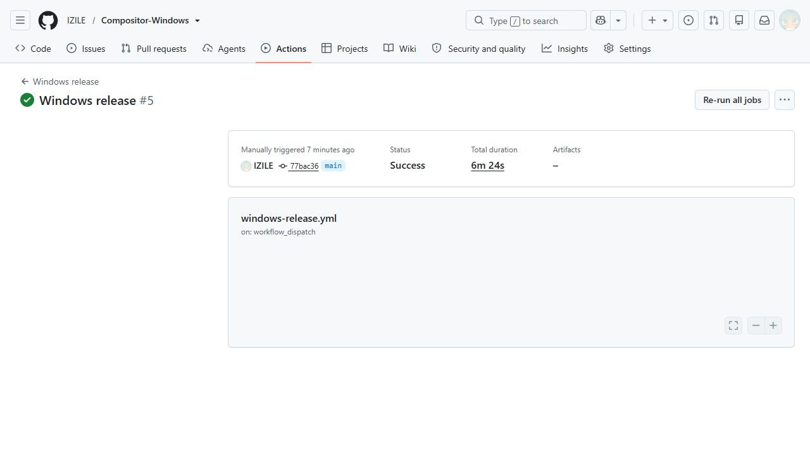

# 阶段 10b：0.6.4 安装、公开发布和独立验证

## 用平实的话说明

这次把“只能输大小”的工具变成了“可拖动，也可精确输入”。空间不够时把滑条收起来，不把文字和其他按钮挤走。矩形、椭圆、直线可以直接选择，并修好了看似换了形状、画布却沿用旧预览的问题。笔刷面板可以导入静态 ABR 笔尖和 PNG；液化／涂抹通过只查附近轨迹减少等待，原来的最终像素不变。原因和界面截图见[阶段 10a](10a-brush-tools.md)。

0.6.4 已覆盖原来的 C 盘安装位置。桌面和开始菜单继续使用同一快捷方式，已有设置保持原样，系统仍只有一个正式卸载入口。双击安装包会显示安装向导，可以“浏览”选择文件夹或其他盘；升级会记住此前的目录。

公开发布后又让一台独立 Windows 云端机器从源码重新构建。这样能够发现仅在开发电脑才碰巧成功的依赖或打包问题。云端检查也已通过，已发布的附件保持原来的摘要，没有被另一份构建覆盖。

## 确认结果的证据

- 本地 962 项核心测试、3561 个界面断言、94 组中英文弹窗及十三组最终 EXE 检查通过。实际路由事件覆盖滑条、数字输入、自适应宽度、形状切换／提交、笔刷导入和连续选择背景。
- 自定义目录首次安装、前版覆盖、安装后运行及卸载检查通过。卸载保留用户测试文件，正式升级保持设置与原安装位置。
- [公开 Release](https://github.com/IZILE/Compositor-Windows/releases/tag/v0.6.4) 的三项附件大小及服务器 SHA-256 与本地一致。源码 ZIP 的 384 个文件与 Git 对象逐一核对相符。
- [独立 Windows 构建](https://github.com/IZILE/Compositor-Windows/actions/runs/37970490098) 的日志确认：962 项核心测试、十三组最终程序检查全部通过，包括新增的四类笔刷计算结果和一次撤销／重做检查。
- 自制和合成样例验证 ABR 原始／RLE、8／16 位静态蒙版；一份真实 ABR 蒙版还与独立解码 PNG 逐字节相等。外部笔刷文件仅用于本地核对，没有包含进公开源码。

公开源码提交：`77bac364f23c760c54d08286fcc125146d6fbecb`。
已安装 EXE SHA-256：`2c5411f6085fd7d8f53ea8489a7002a6108bda8d96aeacb30f6a1ba114e1ebd1`。
安装包 SHA-256：`e99df99c61ea61c5efb581f335edb278d0c20e9db6a8641d65e74e007716851c`。

安装包 48,101,665 字节（约 48.1 MB）；源码 ZIP 5,385,417 字节。安装包相较上一版增加约 10 KB，保留完整运行依赖、格式解码和字体，没有启用有风险的裁剪，也没有增加 ABR 解析库依赖。独立 EXE 约 142 MB，其中包括自带运行环境；不能把安装包大小当作安装后的文件大小。

## 仍有明确边界

ABR 目前恢复静态采样蒙版。现代 ABR 名称、角度、间距、纹理、压感、散布和双重笔刷等描述参数，以及程序生成笔刷尚未支持。导入面板和发布说明都已说明；导入笔尖保留自身软边。图章、修复、模糊、液化、涂抹继续使用原来的圆笔尖。

固定 CPU 测试中，液化约 17819→134 ms，涂抹约 6387→49 ms，四类工具最终像素与修改前一致。这是同一场景的计算时间，不是物理屏幕 FPS。液化／涂抹仍在松手时写入；超大笔刷、图章／模糊、复杂图层合成、最终滤镜和大图读写仍可能等待。

Mac 1.4.7 源码是参考。保留 Windows 窗口按钮、操作逻辑、中英切换和可编辑工程。完整 Mac 功能、逐帧动画曲线、物理 DPI、触控板和真实屏幕延迟尚未全面验收。本次导入面板是新增功能，不能描述为已复刻 Mac 原有笔刷导入。

下一步优先处理图章／模糊笔刷和复杂图层合成的等待，再继续逐项核对 Mac 功能与动画。当前完成的是上述 0.6.4 交付范围，没有给整个复刻项目标记完成比例。

[可编辑 PlantUML](10b-install-release.puml)

