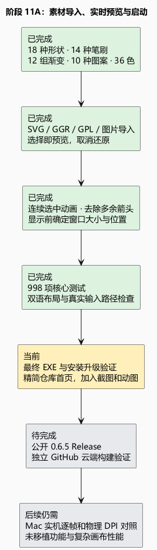

# 阶段 11A：素材导入、实时预览与启动

把素材想成画笔盒里的工具：以前只有很少几种，现在打开盒子就能先看到样式和实际效果，再决定使用。笔刷按钮直接显示笔画，没有多余箭头；切换样式时，选中背景从当前位置继续移动。

新增 18 种可编辑形状、14 种静态笔刷、12 组渐变、10 种图案和 36 个色板颜色。支持 ABR/PNG 笔刷、SVG 单色轮廓、GGR 渐变、PNG/JPEG/WebP 图案以及 GPL 色板导入。导入库保存在用户设置目录，升级保留。

预览调用实际绘制逻辑。笔刷、形状、渐变切换会同步更新工具；色板会同步更新拾色器；图案在独立的预览工程里显示，确认后才写入原工程，且一次撤销即可恢复。取消会还原之前的设置或丢弃图案预览，导入到个人素材库的文件仍保留。

原先渐变界面列出五种模式，底层只实现线性和径向；现在补齐角度、对称和菱形模式，并支持多色节点。新增形状在缩放时重新绘制，SVG 孔洞仍保持透明。

启动闪烁找到一个确定原因：窗口先显示，再从 Opened 回调缩放、重新居中。现在显示前就确定最终大小和位置，命令行打开的工程也先准备好。依据 Avalonia 12.1.3 的实际顺序，原回调确实发生在原生窗口 Show 之后；[固定版本官方源码](https://github.com/AvaloniaUI/Avalonia/blob/12.1.3/src/Avalonia.Controls/Window.cs)支持这一判断。尚不能据此承诺所有显卡和显示器上的启动闪烁都已消失。

验证证据：998 项核心测试通过，包括 SVG 变换/孔洞/重叠、工程保存重开和缩放、GGR 中点与透明度、GPL 颜色、图案选区填充、无效导入不覆盖素材库。102 组中英文弹窗布局检查通过；实际路由点击验证切换、取消、撤销，快速切换动画从当前显示位置接续。最终 EXE 检查和安装验证在阶段 11B 继续确认。

仓库首页改为简介、下载、功能和使用方式，并加入当前应用截图与实际控件动画渲染的 GIF；它们随版本更新。动图不是 Mac 实机录屏，也不是浏览器里的在线图像编辑器。

原 Mac 源码的 BrushControls、ShapeControls、GradientControls 与 ContentView 用于对照工具顺序、交互和样式。Mac 源码比较不等于逐像素或原生动效已完全一致。新增通用素材是用户要求的扩展。

限制：ABR 仍只导入静态采样笔尖；SVG 只支持单色填充路径及基本形状，文字/描边/特效需先转路径；GGR 暂不支持非线性、HSV 或动态颜色段，遇到这些内容会明确报错。普通工程保留格式 11；扩展可编辑形状使用 Windows 格式 12，旧 Mac 读入需使用 PNG/PSD 导出。图片图案上限为 2048 × 2048 像素。

下一步：完成最终程序和安装升级检查，公开发布 0.6.5，再从 GitHub 独立构建同一提交。物理 DPI、Mac 实机逐帧对照和仍未移植的功能继续保留在待办清单。

[编辑 PlantUML](11a-materials-preview.puml)
