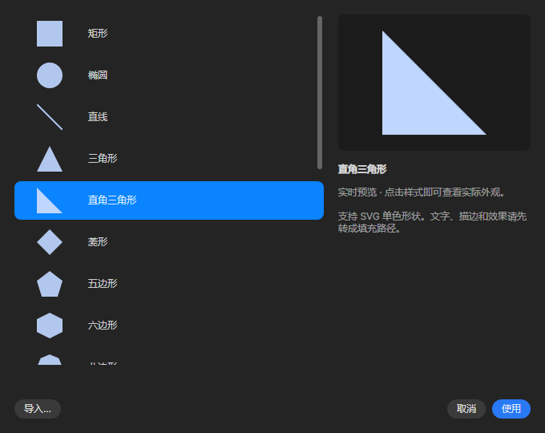
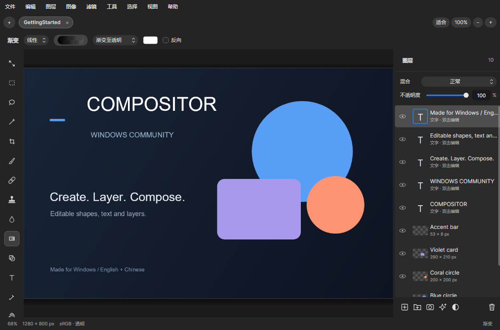
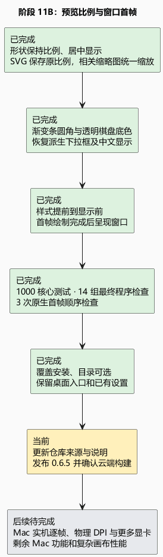

# 阶段 11B：素材预览与启动首帧

这次把“展示一张形状样本”改为像把照片放进相框：只按同一个比例缩放，再放在中间。原来把宽和高分别拉伸，所以三角形会变扁、圆形会变成椭圆。现在列表、工具栏和大预览使用一致的形状比例；导入 SVG 也会记住原比例，旧素材库仍能读取。笔刷和图案缩略图同样避免二次拉伸。

渐变条现在沿自身的圆角轮廓绘制，透明部分显示棋盘格。这补上了 Mac 原版 `GradientControls.swift` 中已有的透明预览方式。检查截图时还发现某些下拉框只占位置却没有画出来，原因是自定义派生控件没有继承基础控件的样式。这次一并修复了渐变、选区、套索等下拉框，以及相关按钮与颜色控件，并确认中文选项正常显示、切换不推移控件。

启动闪屏此前只处理了窗口出现后的尺寸变化，用户实测表明仍不够。这次把数字样式和下拉框翻译提前到内容装入时完成，再让 Windows 暂时保留窗口绘制、等待第一帧完成后才呈现出来。没有修改 Windows 标题栏和窗口操作；若绘制等待超时，仍会恢复窗口，避免软件一直隐藏。实现依据 [Avalonia 12.1.3 的批次绘制完成通知](https://github.com/AvaloniaUI/Avalonia/blob/12.1.3/src/Avalonia.Base/Rendering/Composition/Transport/Batch.cs)与 [Microsoft 的窗口呈现接口](https://learn.microsoft.com/en-us/windows/win32/api/dwmapi/ne-dwmapi-dwmwindowattribute)。

证据：1000 项核心测试通过，新增 SVG 比例保存与旧素材库兼容检查。最终 EXE 的十四组检查通过，包含 3714 项界面断言、102 组双语弹窗和 71 项素材与启动断言。像素检查覆盖宽列表里的形状比例、不同实际尺寸下的圆形、渐变圆角与透明底色；工具栏在中英文、760/1180/1680 宽度下切换保持位置。三次原生 Windows 启动都先绘制完成再解除隐藏，未触发超时回退。最终 EXE SHA256：`1b0c2ea8d8317253a7010e2cfc164e1fd15076023e85100bd7c09333d54ea9d8`。

安装包已通过首次安装、覆盖升级、运行和卸载检查，并覆盖到本机原安装目录，已有设置未变，桌面仍使用同一个快捷方式。这里的原生检查验证了窗口与渲染器的先后顺序，并不是显示器实拍；仍不能据此保证所有显卡、物理 DPI 和刷新率下都绝无闪屏。当前也没有 Mac 实机逐帧对照，尚未完成全部 Mac 功能。下一步是更新 GitHub 的常规项目说明与前置来源，再发布并确认独立云端构建。

仓库首页保留功能、安装、预览和构建说明，将原作与社区移植来源放在最前；具体动画和 UI 修复记录留在版本报告中。

[可编辑 PlantUML](11b-preview-startup.puml)
