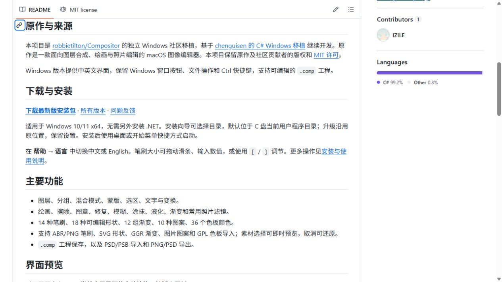
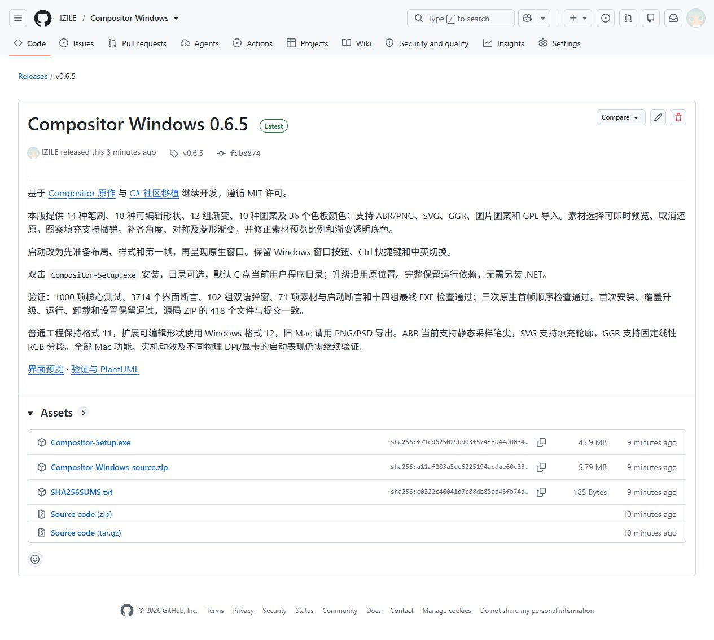
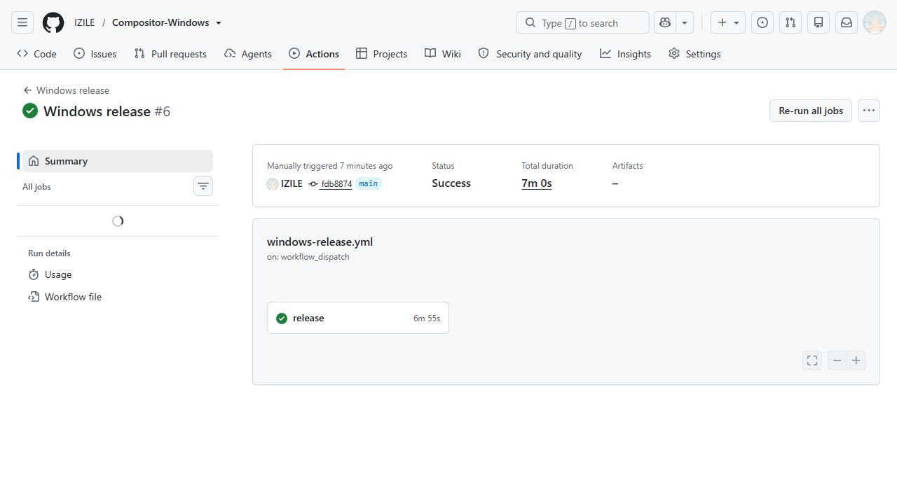
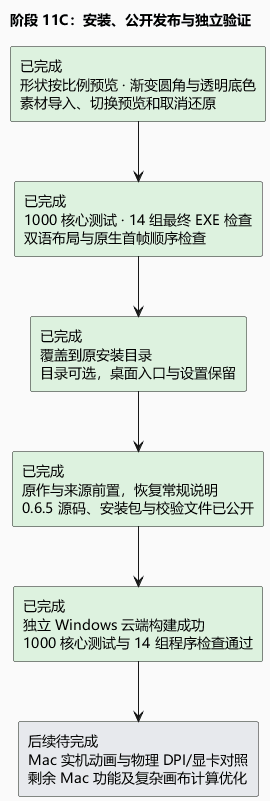

# 阶段 11C：0.6.5 安装与公开发布

现在桌面上的同一个 Compositor 快捷方式，已经指向本次修正后的安装版。安装仍可选择目录；本机升级沿用原位置，原有设置没有改变。安装包通过了首次安装、覆盖升级、启动运行和卸载检查，卸载也保留了测试用户文件。

形状预览现在保留比例，不再为了长方形按钮变扁；渐变条沿圆角显示，透明部分有棋盘底色。其他预览同样避免二次拉伸，并修复了部分下拉框只占位置却未显示及中文选项问题。窗口改为先完成样式、布局和首帧绘制再呈现；三次原生顺序检查通过。功能层面，本版提供常见笔刷、可编辑形状、渐变、图案和色板，以及 ABR/PNG、SVG、GGR、图片图案与 GPL 导入、选择预览和取消还原。

[公开 0.6.5 Release](https://github.com/IZILE/Compositor-Windows/releases/tag/v0.6.5) 中已上传安装包、完整源码 ZIP 和 SHA256 文件；三个附件的大小与 GitHub 校验值都和本地一致。版本标签指向 `fdb8874d8c559fa7166f852caac2878e5b7ab927`，源码 ZIP 的 418 个文件与该提交逐一核对一致。仓库首页恢复常规项目介绍，原作与社区移植来源放在前面，保留当前应用画面，详细修复说明留在版本报告。

独立云端构建相当于让另一台干净的 Windows 电脑从公开源码重新制作一次软件。这次 [GitHub Actions #37991313957](https://github.com/IZILE/Compositor-Windows/actions/runs/37991313957) 已完成：1000 项核心测试及十四组最终程序检查全部通过，发布步骤也成功，并保留了本机验证后上传的三个版本附件。本机另通过 3714 项界面断言、102 组双语弹窗和 71 项素材与启动断言。安装包约 45.9 MiB，保留完整运行依赖。

这还没有证明与 Mac 实机逐帧一致。启动检查确认的是先绘制后呈现的顺序，仍需实际显示器、不同物理 DPI 和更多显卡下的观察；复杂合成、部分笔刷和滤镜仍有计算等待。下一阶段继续处理差异清单中的 Mac 功能和复杂画布性能，并依据实际运行反馈复查闪屏与动效。

安装包 SHA256：`f71cd625029bd03f574ffd44a0034d95e753660ea4479a6b6cf58fe292dfc840`。EXE SHA256：`1b0c2ea8d8317253a7010e2cfc164e1fd15076023e85100bd7c09333d54ea9d8`。详细比例、像素与启动证据见[阶段 11B](11b-preview-startup.md)。

[可编辑 PlantUML](11c-install-release.puml)
