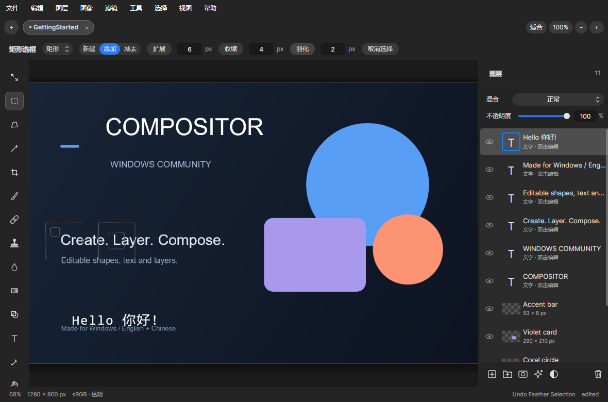
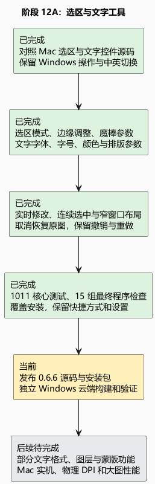

# 阶段 12A：补齐选区与文字工具栏

可以把选区理解为“接下来只处理这块区域”。现在不必记住快捷键或打开菜单：顶部可直接选择新建、添加、减去，也能输入像素后扩展、收缩或羽化边缘。Shift/Alt 临时改变一次操作，松开后仍回到刚才的选择。魔棒容差直接可调，取样可选单点或不同范围的平均值，已有自定义取样大小也保留。

文字工具现在像排版工具一样，可以直接选择系统字体、字号、颜色、左中右对齐、字距和行距；行距 0 表示自动。修改会立即出现在画布上，完成时整段输入和样式调整只记为一次撤销。参数输入后按 Enter 可以继续打字，Windows 数字框的输入和上下键操作仍保留。工具栏空间不足时允许横向滚动，完成／取消按钮固定留在右侧。

检查还发现并修复两个边缘问题：魔棒最大自定义取样标题会被截断；取消已有文字或颜色修改时，重新生成同样的图片会产生“空撤销”，甚至丢失重做。现在为最长取样标题预留空间，取消时恢复原来的图片和文字信息，未改变颜色的确认也不会新增撤销。

## 证据

- 1011 项核心测试通过，桌面构建与发布没有警告或错误。
- 最终 EXE 十五组检查全部通过；其中新增 102 项选区与文字检查，现有 4496 项界面断言和 71 项素材／启动断言通过。
- 新检查包含真实路由的鼠标拖选、键盘输入、数字调整、字体菜单、颜色预览、取消、撤销／重做，并检查中英文与 880／1180／1640 窗口宽度。
- 首次安装、升级、运行、卸载与保留用户文件检查通过；0.6.6 已覆盖原安装位置，桌面快捷方式和已有设置保留，安装目录仍可选择。
- 画面来自实际程序渲染，不是设计稿或物理显示器录像。

## 仍未完成与下一步

本阶段对照本地 Mac 1.4.7 的 `UI/LassoControls.swift`、`UI/TypeControls.swift` 与相关编辑逻辑，移植常用控件和操作；没有据此宣称像素或原生动画时序完全一致。新增样式作用于整层文字，选中部分字符的格式调整、字体悬停试穿、复杂文字整形、AI 对象选择及更多图层／蒙版操作仍待完善。不同物理 DPI、显卡与 Mac 实机动效继续待验证。

本阶段没有新增运行依赖或改变工程格式。普通工程仍为格式 11，扩展形状仍使用格式 12。下一步发布安装包、校验源码与下载文件，并在独立 Windows 云端重新构建和验证。

[可编辑 PlantUML](12a-selection-type.puml)
