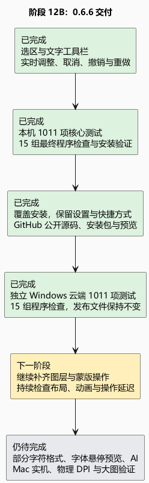

# 阶段 12B：0.6.6 安装与公开发布

这一版把常用选区和文字操作放到顶部，减少来回找菜单。选区像一张“只处理这里”的遮罩，可以连续添加、减去和调整边缘；文字可以边输入边调整字体、字号、颜色和排版，按完成后，整次编辑只占一次撤销。取消已有文字或颜色调整会恢复原图，并保留重做记录。

## 已交付

0.6.6 已覆盖原安装位置，继续使用桌面上的 Compositor 快捷方式。已有设置保留，安装向导仍可选择目录；默认是 C 盘当前用户程序目录。安装包约 45.9 MiB，保留完整运行依赖，无需另装 .NET。本阶段未新增运行依赖，也未改变工程格式：普通工程为 11，扩展形状为 12。

[公开版本与下载](https://github.com/IZILE/Compositor-Windows/releases/tag/v0.6.6) 已包含安装包、源码包和校验文件。源码标签固定在 `05bf3caaf9d27689cf9421abc752229ea0be3abc`，439 个源码包文件与该标签逐项一致。之后补充的交付记录只更新主分支，不改写已经发布的版本文件。

仓库说明保留原作、社区移植来源及 MIT 许可在前的结构；预览已更新为 0.6.6 实际程序渲染，包括文字工具栏和素材选择。程序仍保留中英文切换、Windows 窗口按钮、文件操作和 Ctrl 快捷键。

## 如何确认

本机通过 1011 项核心测试、4496 项界面断言、102 项新增选区／文字交互检查，以及十五组最终 EXE 检查。检查包含真实路由的拖选、输入、参数修改、即时预览、取消、撤销与重做，也覆盖中英文和 880／1180／1640 窗口宽度。

首次安装、模拟旧版升级、运行、卸载及保留用户文件检查通过；实际安装后的 EXE 与本机最终检查的 EXE 哈希一致，已有设置未改动。独立的 [Windows 云端验证](https://github.com/IZILE/Compositor-Windows/actions/runs/38017851409) 也已重新构建，通过 1011 项核心测试及同样十五组最终程序检查。云端发布步骤识别到已有安装包，保留了原来三个下载文件；发布后再次核对文件 ID、大小与 SHA-256 均未改变。

安装包 SHA-256：

`6eca1c127ea332a658ebb50d8265656aaff4dff29747dc582055469c91824f91`

[云端验证摘要](12b-cloud-verification.json) · [功能移植报告](12a-selection-type.md)

## 仍需完善

本次按照 Mac 1.4.7 源码补齐了常用控件；源码移植与自动检查不能证明像素、物理屏幕流畅度和 Mac 原生动画时序完全一致。画面来自应用自动渲染，不是显示器实拍。

文字样式目前作用于整层。部分字符格式、字体悬停预览、复杂文字整形、AI 对象选择、更多图层与蒙版操作仍待补齐；不同物理 DPI、显卡、大图连续操作及 Mac 实机动效也需要继续验证。下一阶段优先推进图层／蒙版的编辑操作，同时继续检查布局、动画衔接和操作延迟。

[可编辑 PlantUML](12b-install-release.puml)
