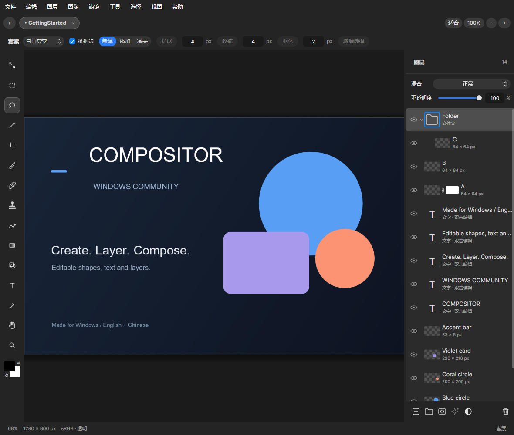
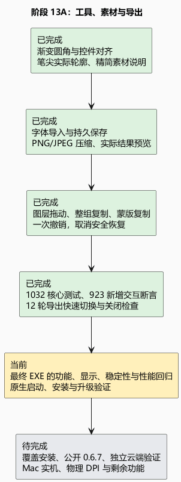

# 阶段 13A：工具更完整，位置更稳定

## 改了什么，为什么有用

渐变预览直接填满按钮，共用同一条圆角边界。按最新要求，工具名称采用自身自然宽度，与第一个控件相隔 8 像素；笔刷／橡皮擦同组切换仍保持位置稳定。分段选择和调整按钮保持同一垂直中心。素材窗口删除通用的“实时预览”介绍，将格式限制移到导入按钮提示里。

笔刷指示器表示“这一笔会碰到哪里”。普通圆笔刷及图章、模糊、液化、涂抹、修复显示圆形工作范围；采样笔尖与橡皮擦根据笔尖透明轮廓显示，保留长宽比例。轮廓在换笔尖时计算，移动时复用，避免为了画光标重新合成图像。

文字工具加入 TTF/OTF 字体导入。字体放在软件自己的素材库，导入后马上用于当前文字，重启后仍可选。导出 PNG 可选择三档无损压缩，JPEG 可拖动或输入质量，并比较原图与压缩后的画面。显示的大小来自真正准备好的文件；最终保存直接使用该文件，避免预览与导出不一致。计算在后台串行执行，快速调节只采用最后一次结果；关闭时等任务结束再释放图片。

图层可从名称或行内空白拖动排序、移入文件夹；Ctrl+拖动复制图层或整组，Alt+拖动蒙版缩略图复制蒙版。复制图层与撤销历史中的蒙版信息各自独立，避免改一份时连带改变另一份。一次拖动只产生一次撤销，Esc 或切换工程取消未完成的拖动。

## 目前的证据

- 1032 项核心测试通过；桌面构建与单文件发布没有警告或错误。
- 923 项新增交互断言通过，涵盖图层拖动、文件夹复制、蒙版复制、字体导入、笔尖轮廓、压缩文件与取消操作。
- 遍历全部工具，在中英文及 880、1180、1640 宽度检查文字、数字、自然标题间距与垂直中心；渐变内外尺寸和圆角值一致。
- 连续移动笔尖 100 次未重建轮廓，也未重新合成文档。PNG 三档压缩逐像素往返一致；JPEG 调低质量后实际文件变小。
- 12 轮导出反复打开，每轮连续改 24 次参数，交替使用取消与窗口关闭；任务全部结束，没有遗留窗口或已准备的临时文件。
- 检查中发现并修复行内空白不能起拖，以及导出关闭时任务释放顺序和取消请求清理的问题。
- 以下画面来自实际应用自动渲染，不是设计稿或物理屏幕录像。

## 仍未完成与下一步

最终 EXE 的全面回归、原生启动检查、安装升级和 GitHub 发布正在进行，本阶段不把这些标为完成。源码对照参考 Mac 1.4.7 的图层拖放、蒙版复制、选区控件和画笔光标，保留 Windows Ctrl/Alt、原生窗口按钮和文件选择方式；没有据此认定像素与原生动画时序一比一。

字体尚未嵌入工程：换电脑继续编辑需要再导入同一字体，工程中已有文字图像仍可显示和导出。仍缺逐段文字格式、复杂文字整形、AI 对象选择、蒙版独立变换等能力。大图最终合成及部分滤镜仍可能等待；跨显卡、物理 DPI、Mac 实机动画和长期稳定性继续待验证。

本版没有增加运行依赖或改变工程格式。下一步用最终 EXE 检查工具、弹窗、保存与撤销、快速反向切换动画、连续涂抹、启动和压缩导出；修复后再覆盖安装并公开发布。

[可编辑 PlantUML](13a-workspace-tools.puml)
