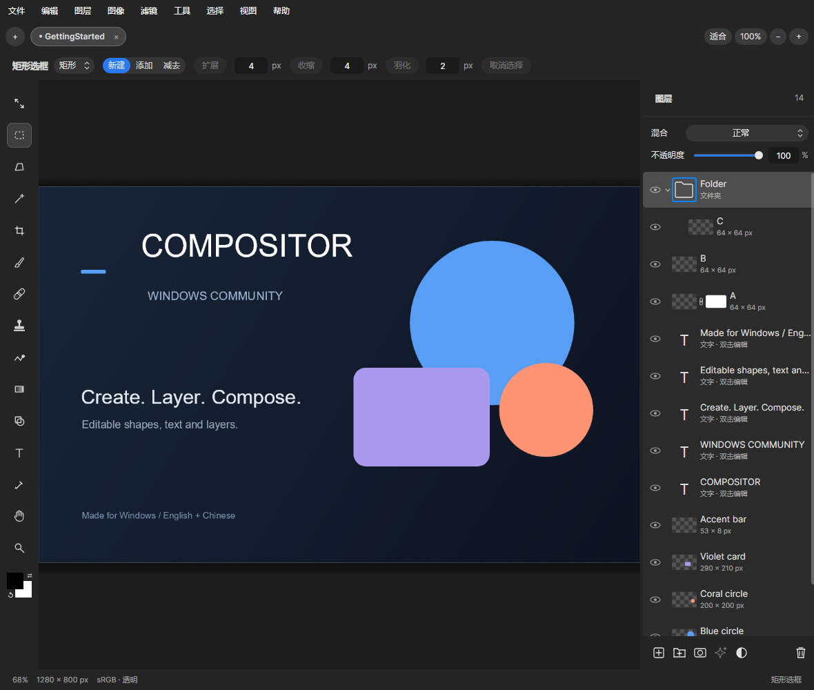
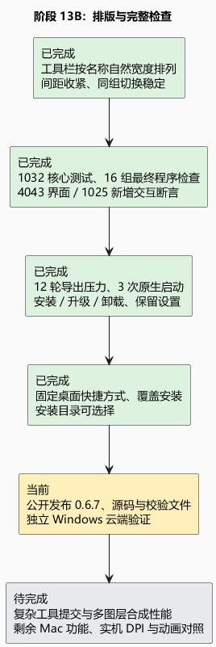

# 阶段 13B：紧凑排版、完整回归与安装交付

## 改了什么，为什么有用

工具栏现在按各工具名称的实际长度排列，名称与第一个控件相隔 8 像素。不再为了让所有工具的控件从同一位置开始，给短名称留一大块空白。笔刷／橡皮擦是同一组设置的两个模式，仍保持控件位置稳定，连续切换不会把滑条从鼠标下方移走。控件组之间保留间隔，组内的名称、滑条、数字和单位紧凑组合，并保持垂直居中。

分段选择根据按钮真实字体和模板自动测量，避免中英文按钮截字。首次布局直接放好选中背景，点击后才连续移动，避免刚打开控件时从错误位置滑入。渐变预览和外框共用一个圆角、一个边界；笔尖轮廓按实际透明范围显示并复用缓存。

字体导入、PNG／JPEG 压缩、图层拖动与蒙版复制的说明和前阶段证据见[阶段 13A](13a-workspace-tools.md)。README 将原作与社区来源放在前面，删除指定的语言／笔刷操作段落及“无需另外安装 .NET”；素材窗口删除通用预览介绍，格式限制保留在导入按钮提示中。

## 用什么确认

- 1032 项核心测试通过。最终单文件 EXE 的 16 组检查全部通过，涵盖界面、弹窗、中英文 Windows 操作、工程生命周期、点击与快捷键、Camera Raw、动画、图标、材料、编辑控件、性能及新增工具。
- 4043 项界面断言、104 个双语弹窗用例、1025 项新增交互断言通过。遍历所有工具，检查中英文及 880／1180／1640 宽度的文字、数值、自然标题间距和垂直中心；另检查 760 宽工具栏的自适应布局与笔刷／橡皮擦稳定切换。
- 动画检查覆盖左侧工具、标签、分段选择、菜单、弹出窗口、滚动与忙碌状态，包括快速反向切换及选中／悬停背景；这是应用渲染帧和状态检查，不等于显示器高速录像。
- 12 轮导出窗口，每轮快速改 24 次参数后取消或关闭，确认后台任务结束、临时文件清理、不显示旧结果。PNG 压缩逐像素往返一致，JPEG 预览来自真正编码结果。
- 三次原生启动确认“准备布局与样式→完成首帧→显示窗口”的顺序，无超时。首次安装、覆盖升级、卸载通过，测试目录中的用户文件保留；实际安装 EXE 哈希与最终回归程序一致。
- 已覆盖安装到原来的 C 盘用户程序目录，桌面与开始菜单使用固定快捷方式。已有设置、字体和素材文件逐一校验未改变；安装向导仍可选择位置，升级沿用现有位置。

以上来自实际应用自动渲染，不是设计稿。

## 性能结果与局限

固定 CPU 场景（2048×1536、六图层）中，平移中位数 2.25 毫秒，缩放 2.43 毫秒，4096 点套索草稿 4.09 毫秒。40 像素软笔刷每次增量更新中位数 0.90 毫秒，松手提交约 20.22 毫秒；200 像素软笔刷增量更新中位数 4.59 毫秒。这些数值测计算和绘制，不包含鼠标到显示器的实际延迟，也不能由此保证所有机器流畅。

仍有等待：1024×768、128 点整条笔画的最终 CPU 提交，图章约 154 毫秒，模糊约 278 毫秒，液化约 149 毫秒，涂抹约 50 毫秒。六图层不透明度重合成约 40 毫秒、变换约 43 毫秒。后续应优先将这些提交与合成改为可复用的局部更新，保持输出像素一致。

安装包约 45.94 MiB。本版未增加运行依赖，未改变工程格式，也未通过删功能或不安全裁剪来缩小体积。

## 已交付、未完成与下一步

本机安装已完成，GitHub 0.6.7 发布与独立 Windows 云端验证正在进行；本报告暂不把它们列为完成。

Mac 1.4.7 源码对照已进行；Mac 实机动画时序、所有物理 DPI／显卡、长时间编辑稳定性尚未全部验证。字体目前保存在应用自己的素材库，没有嵌入工程；换电脑继续编辑需要重新导入。蒙版独立变换、跨工程图层拖放、复杂文字整形、逐段文字格式和 AI 对象选择仍待补齐。

下一步优先处理复杂笔刷与多图层合成的提交延迟，再继续补齐 Mac 功能和实机显示验收。

[可编辑 PlantUML](13b-verification-release.puml) · [验证明细](verification-0.6.7.json) · [功能差异](mac-parity-checklist.md)

最终 EXE SHA-256：`0ade0a85fcb4f598fa99c744ca57b05c03dc1263dcfbabd309f24088be72339b`

安装包 SHA-256：`24a4356bf410cd675d26e79e3fb970f64d994b4bb3562d791b0a5579a5f96f41`
